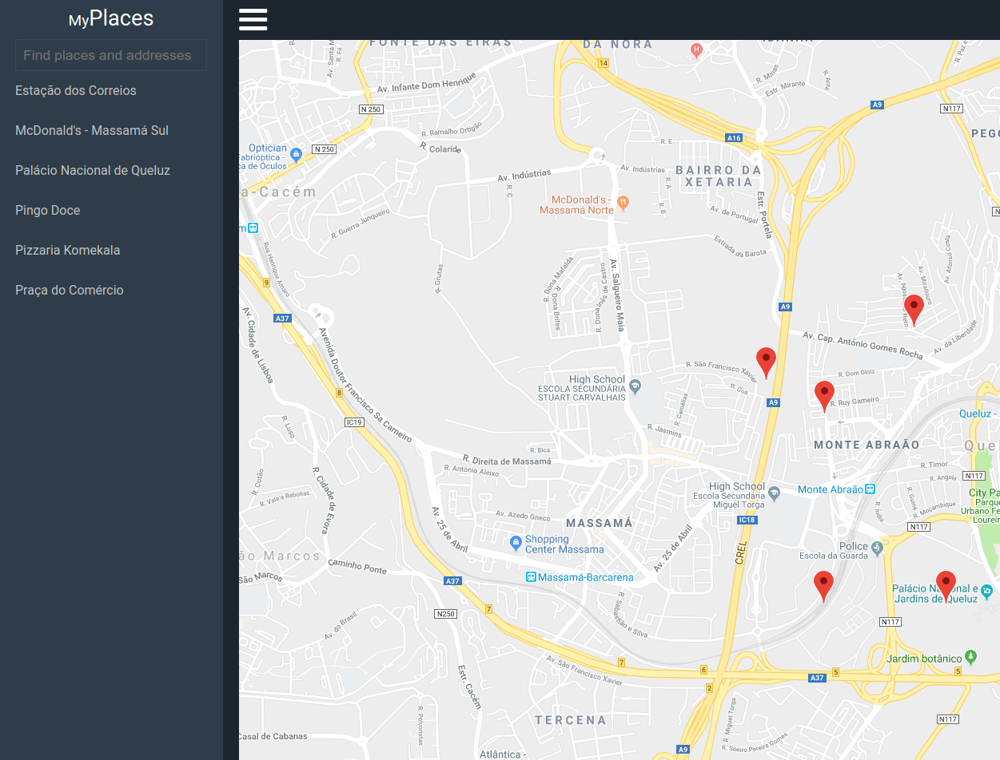

# myPlaces: Find interesting places!

This project has been part of the nanodegree udacity course, and aims to show places of interest on an interactive map.



## Prerequisites

Before, make sure you have the [Node.js](https://nodejs.org/) + NPM installed and configured on your machine

## Installation

Clone the repository and install all dependencies by running the code below.

```sh
$ git clone https://github.com/Cantuares/myplaces.git
$ npm install
```
## How to use

To use the project and put it working just run the code below in the terminal.

```sh
$ npm start
$ npm watch-css
```

To create a production build

```sh
$ npm run build
```
